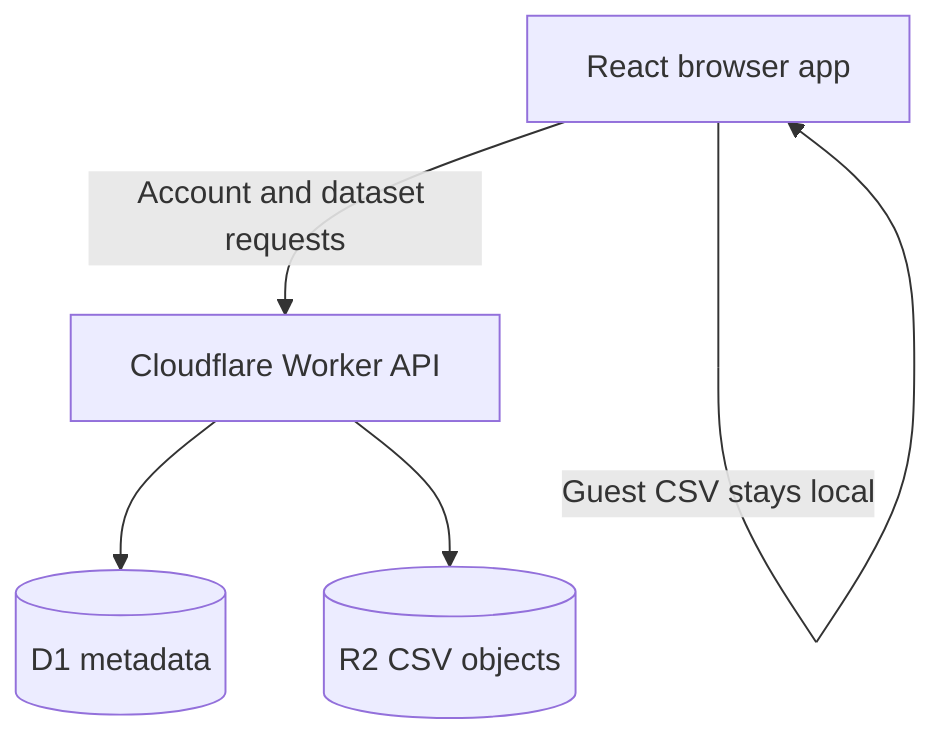

# React Analytics Dashboard

A full-stack CSV analytics portfolio application built on React and Cloudflare. Users can create a username-only account, persist private datasets, and reopen them later. Guests receive the complete analytics demo without uploading or saving their data.

## Live application

[react-analytics-dashboard.pages.dev](https://react-analytics-dashboard.pages.dev/)

> The Cloudflare Pages deployment is being migrated to a Workers Static Assets deployment so the frontend and API run as one application.

## Features

- Upload and validate CSV files up to 10 MB
- Username and password accounts with live username availability checks
- Secure opaque sessions stored in HttpOnly, Secure, SameSite cookies
- Guest mode with full analytics and browser-only data
- Private, owner-scoped saved datasets
- Reopen and delete persisted datasets
- Automatic numeric and categorical column detection
- Dataset completeness and missing-value analysis
- Category counts and numeric aggregations
- Interactive Recharts visualisations
- Search and multi-column filtering
- Responsive light and dark interface

## Cloudflare-native stack

| Layer | Technology | Responsibility |
|---|---|---|
| Interface | React 19, TypeScript, Vite, Tailwind CSS | Upload, analysis, exploration, and charts |
| API | Cloudflare Workers | Authentication and owner-scoped dataset endpoints |
| Relational data | Cloudflare D1 | Users, password hashes, sessions, and dataset metadata |
| Object storage | Cloudflare R2 | Private CSV file contents |
| Hosting | Workers Static Assets | React SPA and API in one deployment |
| Monitoring | Workers Observability | Request logs and runtime errors |

Interactive analysis remains client-side for a responsive experience. The Worker validates every saved upload, D1 stores its metadata, and R2 stores its original CSV object. Guest uploads never leave the browser.

## Architecture



## Application routes

| Route | Purpose |
|---|---|
| `/login` | Sign in or continue as a guest |
| `/register` | Create a username and password account |
| `/datasets` | Reopen or delete saved datasets |
| `/upload` | Upload and parse a CSV |
| `/dashboard` | Review KPIs, quality metrics, aggregations, and charts |
| `/explore` | Search, filter, and inspect rows |

## API routes

| Method and route | Purpose |
|---|---|
| `POST /api/auth/register` | Register and start a session |
| `POST /api/auth/login` | Sign in and start a session |
| `POST /api/auth/logout` | Revoke the current session |
| `GET /api/auth/me` | Restore the current user |
| `GET /api/auth/username-available` | Check a normalized username |
| `GET /api/datasets` | List the current user's datasets |
| `POST /api/datasets/upload` | Validate and persist a CSV |
| `GET /api/datasets/:id/content` | Read an owned CSV from R2 |
| `PATCH /api/datasets/:id/name` | Rename an owned dataset |
| `DELETE /api/datasets/:id` | Delete owned metadata and object data |

## Local development

### Prerequisites

- Node.js 24
- npm
- A Cloudflare account for remote D1/R2 and deployment

Install dependencies:

```bash
npm install
```

Apply the D1 migration to Wrangler's local database:

```bash
npm run db:migrate:local
```

Start the Worker on port 8787:

```bash
npm run dev:worker
```

In a second terminal, start Vite. Its `/api` development proxy points to the local Worker:

```bash
npm run dev
```

Local Wrangler uses local D1 and R2 storage. No Docker, PostgreSQL, .NET SDK, R2 access key, or application secret is required.

## Cloudflare deployment

The committed `wrangler.jsonc` binds:

- D1 database `react-analytics-dashboard-db`
- R2 bucket `react-analytics-dashboard-data`
- Static assets from `dist`

Authenticate Wrangler, apply the production schema once, and deploy:

```bash
npx wrangler login
npm run db:migrate:remote
npm run deploy
```

The D1 database ID and R2 bucket name are resource identifiers, not credentials. A Worker accesses both through bindings, so R2 S3 access keys must not be committed or configured for this application.

## Quality checks

```bash
npm run lint
npm test
npm run typecheck:worker
npm run build
npx wrangler deploy --dry-run
```

GitHub Actions runs the same lint, test, frontend build, Worker type-check, and Worker bundle validation on pushes and pull requests.

## Security and privacy

- Passwords are derived with salted PBKDF2-SHA-256 hashes and never stored in plaintext.
- Random session tokens are stored only as SHA-256 hashes in D1.
- The browser receives the session token only through an HttpOnly cookie.
- State-changing API requests enforce a same-origin check.
- Every dataset query includes the authenticated owner's ID.
- R2 objects use owner-prefixed, generated keys rather than user-controlled paths.
- Guest CSV files remain in browser memory and are never sent to the API.

## Project structure

```text
migrations/       D1 schema migrations
public/           Static sample data
src/              React application
worker/           Cloudflare Worker API and tests
wrangler.jsonc    D1, R2, assets, and observability bindings
```

## Current limitations

- CSV only
- Intended for small and moderate datasets up to 10 MB
- No password recovery because accounts intentionally do not require email
- No collaborative dashboards or shared datasets
- Type detection is heuristic rather than schema-driven

## What I learned

- Designing a full-stack React and TypeScript application
- Building serverless REST APIs with Cloudflare Workers
- Relational modelling and migrations with D1
- Private object storage with R2 bindings
- Password hashing, opaque sessions, and ownership isolation
- Multipart upload handling and server-side CSV validation
- Client-side analytics, filtering, aggregation, and visualisation
- Guest-mode privacy and progressive enhancement
- Full-stack CI and single-deployment architecture

## Author

**Jason Leonard** — Graduate Full Stack Developer based in Melbourne, Australia.

- [GitHub](https://github.com/jason1511)
- [LinkedIn](https://linkedin.com/in/jason-leonard-197230163)

## Licence

This project is provided as a portfolio and learning project. Unless a separate licence is added, the source should not be treated as licensed for redistribution or commercial reuse.
